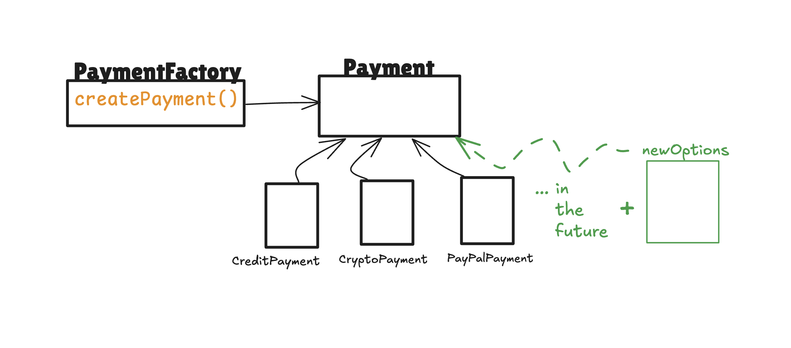

# 🏭 Simple Factory Design Pattern - Payment System

Bu proje, **Simple Factory Design Pattern**'ini öğrenmek ve uygulamak için geliştirilmiş bir ödeme sistemi örneğidir.

## 📋 Proje Amacı

Bu proje, nesne oluşturma mantığını merkezi bir factory sınıfına taşıyarak:
- **Kod tekrarını azaltmak**
- **Genişletilebilirliği artırmak** 
- **Loose coupling** sağlamak
- **Open/Closed prensibi** uygulamak

için tasarlanmıştır.

## 🎯 Problem ve Çözüm

### ❌ Geleneksel Yaklaşım (PaymentCaseController.js)
```javascript
function processPayment(type, amount) {
  if (type === 'credit') {
    console.log('Processing CREDIT CARD payment...');
  } else if (type === 'paypal') {
    console.log('Processing PAYPAL payment...');
  } else if (type === 'crypto') {
    console.log('Processing CRYPTO payment...');
  }
}
```

**Sorunlar:**
- Her yeni ödeme türü için if-else bloğu eklenmeli
- Kod tekrarı (DRY prensibi ihlali)
- Sıkı bağlılık (tight coupling)
- Test edilmesi zor

### ✅ Factory Pattern Yaklaşımı (NewPaymentController.js)
```javascript
const factory = new PaymentFactory();
function processPayment(type, amount) {
    const payment = factory.create(type);
    payment.processPayment(amount);
}
```

**Avantajlar:**
- Merkezi nesne oluşturma
- Kolay genişletilebilirlik
- Loose coupling
- Test edilebilirlik

## 🏗️ Proje Yapısı

```
SimpleFactory/
├── PaymentCaseController.js          # Geleneksel yaklaşım
├── NewPaymentController.js           # Factory pattern yaklaşımı
├── Solution/
│   ├── Payment.js                    # Base Payment sınıfı
│   ├── PaymentFactory.js             # Factory sınıfı
│   ├── CreditPayment.js              # Concrete implementation
│   ├── PayPalPayment.js              # Concrete implementation
│   ├── CryptoPayment.js              # Concrete implementation
│   └── NPaymentControllerTest.js     # Test dosyası
└── README.md
```

## 🎨 Tasarım Diyagramı



### Diyagram Açıklaması:
- **PaymentFactory**: Nesne oluşturma sorumluluğunu üstlenen merkezi sınıf
- **Payment**: Tüm ödeme türleri için ortak interface/base sınıf
- **Concrete Classes**: CreditPayment, PayPalPayment, CryptoPayment
- **Future Extensions**: Yeşil alan gelecekte eklenebilecek yeni ödeme türlerini gösterir

## 🚀 Kullanım

### 1. Geleneksel Yaklaşımı Test Etme
```bash
node PaymentCaseController.js
```

### 2. Factory Pattern Yaklaşımını Test Etme
```bash
node NewPaymentController.js
```


## 📊 Test Sonuçları

### Geleneksel Yaklaşım:
```
Processing CREDIT CARD payment...
Charging $100 to credit card
Payment successful ✅
```

### Factory Pattern:
```
[Factory] create(type="credit")
[Service] Processing CREDIT payment of $100
işlem başarılı ✅
```

## 🔧 Yeni Ödeme Türü Ekleme

Factory pattern sayesinde yeni ödeme türü eklemek çok kolay:

1. **Yeni sınıf oluştur** (örn: `BankTransferPayment.js`)
2. **Payment sınıfından extend et**
3. **PaymentFactory'e ekle**

```javascript
// 1. Yeni sınıf
class BankTransferPayment extends Payment {
    constructor() {
        super('banktransfer');
    }
}

// 2. Factory'e ekle
this.paymentMap = {
    credit: CreditPayment,
    paypal: PayPalPayment,
    crypto: CryptoPayment,
    banktransfer: BankTransferPayment  // Yeni eklenen
};
```

## 🎓 Öğrenilen Kavramlar

- **Simple Factory Pattern**
- **Inheritance** (Kalıtım)
- **Polymorphism** (Çok biçimlilik)
- **Loose Coupling**
- **Open/Closed Principle**
- **Single Responsibility Principle**

## 📚 Design Pattern Faydaları

✅ **Genişletilebilirlik**: Yeni ödeme türleri kolayca eklenebilir  
✅ **Bakım Kolaylığı**: Merkezi nesne oluşturma  
✅ **Test Edilebilirlik**: Her sınıf bağımsız test edilebilir  
✅ **Kod Tekrarı Azalması**: DRY prensibi uygulanır  
✅ **Esneklik**: Runtime'da nesne türü belirlenebilir  

---

*Bu proje, design pattern'lerin gerçek dünya uygulamalarında nasıl kullanıldığını öğrenmek için tasarlanmıştır.*
