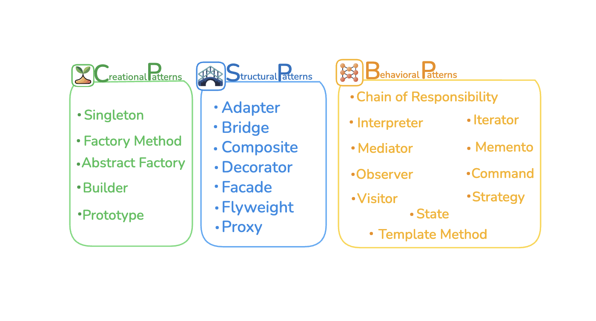

# 🎯 Design Patterns

Bu repo, yazılım geliştirmede kullanılan **Design Pattern (Tasarım Kalıpları)** kavramlarını öğretmek amacıyla hazırlanmıştır.  
Amaç: Kalıpları sade bir dille açıklamak, sınıflandırmak ve görseller ile desteklemek.  

  

---

## 🏗️ Design Pattern Kategorileri

### 1. Creational (Yaratımsal)
Nesne oluşturma sürecini yönetir:  
- Singleton  
- Factory Method  
- Abstract Factory  
- Builder  
- Prototype  

### 2. Structural (Yapısal)
Sınıf ve nesnelerin yapısını düzenler:  
- Adapter  
- Bridge  
- Composite  
- Decorator  
- Facade  
- Flyweight  
- Proxy  

### 3. Behavioral (Davranışsal)
Nesneler arası iletişim ve davranışları yönetir:  
- Chain of Responsibility  
- Command  
- Interpreter  
- Iterator  
- Mediator  
- Memento  
- Observer  
- State  
- Strategy  
- Template Method  
- Visitor  

---

## 🎓 Bu Repo Ne Sağlar?

- Design Pattern’ların **tanımlarını** öğrenmek  
- Hangi **problemleri çözdüklerini** görmek  
- Kategoriler arası farkı anlamak  
- Görselle desteklenen kısa özetlere ulaşmak  

